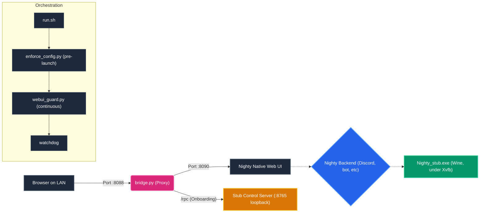

# Architecture

How `nighty-linux-headless` runs a desktop-GUI app headless and exposes its Web UI over the LAN.

## The Problem

Nighty is a PyInstaller one-file app whose UI is `pywebview` backed by the Windows WebView/.NET stack. On a headless Linux host running the Windows build under **Wine** (with an x86-64 emulator such as Box64 underneath on non-x86 machines), that GUI layer cannot render, and the program never finishes starting. 

But Nighty *also* ships a built-in **Web UI** (a local Flask/Werkzeug server) that only comes up once the program has started normally.

So: we need the program to start without a renderable desktop GUI, then use its own Web UI.

## The Approach

### 1. Headless GUI Stub (`scripts/repack.py`)

PyInstaller stores Python modules in a `PYZ` archive inside the exe. `repack.py` parses the `CArchive`/`PYZ`, **replaces only the `webview` package** with a drop-in stub, copies everything else byte-for-byte, and rewrites the archive with the original bootloader.

The stub:
- Implements the `webview` API surface (`create_window`, `start`, `Window`, events) as no-ops, so the program's startup path completes instead of crashing on GUI init.
- Captures the JS-API object Nighty hands to `create_window`, and runs a small **loopback control server** (default `127.0.0.1:8765`) used only during first-run onboarding.
- Runs all API calls on a single dispatcher thread (real pywebview does the same), which is required so the bot's asyncio/aiohttp event loop is stable.

> [!IMPORTANT]
> This does **not** touch Nighty's licensing or its protected code — it only swaps the GUI layer. You still need a valid Nighty license and your own exe.

> [!NOTE]
> The repack must run under **Python 3.8**, because the embedded code objects are 3.8 bytecode and the `marshal` format is version-specific. `install.sh` fetches a 3.8 interpreter via `uv` for this one step.

### 2. Config Enforcement (`scripts/enforce_config.py`)

Run before every launch (and continuously, see below). It edits the files under `…/AppData/Roaming/Nighty Selfbot/` inside the Wine prefix:

- **`data/notifications.json`** — every boolean under the `toast` and `sound` groups is set to `false` (a headless box should never raise popups or play sounds).
- **`web_config.json`** — Web UI username/password/host/port from your `.env`.
- **`nighty.config`** — `web = true`.

### 3. Web UI Hard-Enforcement (`scripts/webui_guard.py`)

A short loop that re-asserts `web = true` (and the credentials) every few seconds. If Nighty or the user disables the Web UI from the interface, it is forced back on within `ENFORCE_INTERVAL` seconds — the Web UI is the only usable interface on a headless box, so it must never stay off. Writes only on change.

### 4. Orchestration & Persistence (`scripts/run.sh` + systemd)

`run.sh` is the single entry point: it starts the virtual display, the config enforcement, the **LAN bridge**, and the **backend**, and keeps each alive. Run with no arguments it offers a menu — *run once* or *install autostart* — and for autostart it writes/enables a systemd unit (`nighty.service`) for you. Two layers of persistence:

- **`run.sh`** wraps the backend (and the bridge) in `while true` loops: when Nighty exits (including a UI "restart" / "close"), it re-enforces config and relaunches; the bridge is likewise restarted if it ever dies.
- **systemd** (`nighty.service`, `Restart=always`) supervises `run.sh --run` itself and brings the whole stack back after a crash or a reboot.

Before any component starts, `run.sh` acquires a lock in `$NIGHTY_HOME`. A second invocation probes the existing bridge, prints its panel URL, and exits without touching the live processes. A process/bridge migration probe protects instances started by older releases which do not yet hold the lock. Exit status 23 tells systemd that a duplicate was intentionally refused and must not enter a restart loop.

### 5. LAN Bridge (`scripts/bridge.py`)

A thin reverse proxy. Once the native Web UI (`:8090`, loopback) is up, the bridge serves it on `:8088` across the LAN (forwarding cookies, etc.). While the panel is still starting, it serves a clean onboarding flow driven through the stub control server:

1. **Activate** - save your Nighty license key (`auth.json`), then restart the backend so it boots licensed (without a license the bot connects but its `on_ready` aborts at `KeyError('motd')` before syncing commands).
2. **Sign In** - paste your Discord account token (`saveTokenToConfig`).
3. **Connect Bot** - paste your bot token; the bridge validates it and its privileged intents against Discord's API *before* handing it to Nighty.
4. **Authorize** *(only if needed)* - if the bot has not been authorized on your Discord yet, Nighty parks on its `auth.html` screen and never starts the panel. The bridge detects this and shows an **Authorize** page with the exact Discord OAuth2 link for your application. After you approve it on Discord, "continue" restarts the backend so Nighty re-reads the authorization.

Once onboarded, `_auto_resume` replays the sign-in + bot steps on each boot, so a reboot restores the panel with no human in the loop.

> [!TIP]
> The native UI uses **socket.io (WebSockets)** for live updates. The bridge detects the `Upgrade: websocket` request and switches that connection into a `select()`-based, full-duplex tunnel with `TCP_NODELAY` (Nagle off) and TCP keepalive. Disabling Nagle is what keeps the latency-sensitive engine.io upgrade probe flowing, so the panel stays connected instead of falling into a "Disconnected — Reconnecting…" loop.

---

## Docker Architecture

When running via Docker (the recommended deployment method), the architecture adapts to enforce strict isolation and security:

1. **Unprivileged Container:** The image builds and runs entirely under a non-root user (`nighty`, UID `1000`). It avoids running Wine or Xvfb as root.
2. **Dynamic Permission Mapping:** If the host user runs Docker with a different UID, the `docker-start.sh` script actively reads your host's UID/GID and passes it to `docker-compose` as `USER_ID` and `GROUP_ID`. The `Dockerfile` modifies the internal `nighty` user on-the-fly to match your host, completely eliminating volume permission conflicts.
3. **Secret Injection:** Web UI credentials (`.env`) are never baked into the image. They are stored on the host in `docker-secrets/` with strict `644` permissions inside a `700` directory, and mapped into the container as read-only volumes. The orchestrator inside the container reads these safely.
4. **Log Rotation:** The `json-file` driver settings in `docker-compose.yml` (`max-size`, `max-file: 1`) cap the container's **stdout/stderr** stream only. They do not bound the stack's logs, because `run.sh` redirects every component to real files under the bind-mounted `diagnostics/` directory rather than to the container's stdout. Those files are rotated by `scripts/rotate_logs.py` at each backend launch and by the guard on a `ROTATE_INTERVAL` timer, which copy-truncates in place so the `O_APPEND` writers keep their inode. Nighty's own `nighty.log` lives inside the Wine prefix and is mirrored into `diagnostics/`, never rewritten — the backend holds it open, so truncating it would corrupt the running process's log.

---

## Emulation Layer (Box64 & Wine)

To support non-x86 architectures (like ARM64 on Raspberry Pi), the wrapper injects an emulation layer below Wine:

- **x86-64 API Translation (Wine):** The Windows binary `Nighty.exe` calls `Win32` APIs. Wine catches these and translates them into native POSIX/Linux system calls.
- **CPU Instruction Emulation (Box64):** Because the binary contains x86-64 machine code, Wine itself must be compiled for x86-64. On an ARM host, the kernel cannot execute this. We wrap Wine with **Box64**, a dynamic recompiler (Dynarec). Box64 reads the x86-64 instructions and recompiles them into native ARM64 instructions on the fly.
- **Library Wrapping:** Box64 is highly optimized. Instead of emulating Linux libraries (like `libX11`, `libc`), it maps calls from the emulated x86-64 Wine directly to the native ARM64 system libraries on your host. This is why the installer ensures native `libX11` and `libXcomposite` packages are installed.
- **Tuning:** Emulating Rich-Presence network blocking can cause severe lag under Box64 (crashing the Discord bot heartbeat). The script provides tuning profiles (`NIGHTY_BOX64_PROFILE`: `safe`, `balanced`, or `performance`) and explicitly blackholes external blocking API domains (`lrclib.net`) in `/etc/hosts` to keep the emulation loop fast and reliable.

---

## Data & Storage Locations

Everything Nighty and this wrapper persist lives **outside the repository**, which is why deleting the project folder (or the systemd unit) does *not* reset Nighty: the next install points back at the same runtime directory and finds it already onboarded. To return to a truly clean state, use `scripts/uninstall.sh`.

**Runtime root — `$NIGHTY_HOME`** (from `.env`; default `~/.local/share/nighty`):

| Path | What it holds |
|------|---------------|
| `$NIGHTY_HOME/prefix/` | the **Wine prefix** (`WINEPREFIX`) — the Windows world Nighty runs in |
| `$NIGHTY_HOME/wine/` | the static x86-64 Wine build (non-x86 hosts only) |
| `$NIGHTY_HOME/backend.log`, `bridge.log`, `guard.log`, `stub_webview.log` | logs |

**Nighty's own config — inside the prefix**, at `$NIGHTY_HOME/prefix/drive_c/users/<user>/AppData/Roaming/Nighty Selfbot/`:

| File | What it holds |
|------|---------------|
| `auth.json` | your **Nighty license key** |
| `nighty.config` | accounts, the active login, the **account + bot/app tokens**, app id, `web=true` |
| `web_config.json` | Web UI username / password / host / port |
| `data/` | notifications settings, themes, scripts, analytics, etc. |

**Outside `$NIGHTY_HOME`:**

| Path | What it holds |
|------|---------------|
| `<repo>/.env` | resolved paths + your Web UI credentials |
| `<repo>/Nighty.exe`, `Nighty_stub.exe` | your binary and the repacked stub (never committed) |
| `/etc/systemd/system/nighty.service` | the autostart unit (if you enabled autostart) |

**Generic tooling installed by `install.sh` if missing** — *not* Nighty-specific, so the uninstaller leaves it alone by default: `uv` (`~/.local/bin/uv`, with a Python 3.8 under `~/.local/share/uv` / `~/.cache/uv`), **Box64** (`/usr/bin/box64` + its apt repo files under `/etc/apt/`), and your distro's Wine packages.

---

## Ports & Health Endpoints

| Port / Endpoint | Bind | Purpose |
|-----------------|------|---------|
| `8088` (`/`) | LAN (0.0.0.0) | The bridge — open this in a browser for Web UI / onboarding. |
| `8088` (`/healthz` or `/ready`) | LAN (0.0.0.0) | JSON health check & readiness probe for Docker / monitoring tools. |
| `8090` | loopback | Nighty's native Web UI (proxied by 8088). |
| `8765` | loopback | Stub control server (onboarding only). |

> [!WARNING]
> Only 8088 is meant to be reachable from the LAN. Keep 8090 and 8765 on loopback to ensure security.
